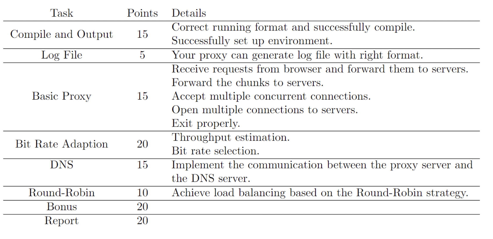

## CS305 Project Report

>2022.5.31



#### Group Member

| SID      | NAME   | Work Division |
| -------- | ------ | ------------- |
| 11910104 | 王奕童 | 33.33%        |
| 11912714 | 任艺伟 | 33.33%        |
| 11912733 | 黄颖盈 | 33.33%        |

#### Diagram and Analysis


#### Compile and Output

We follow the `README.md` in `CS305_proj`, and build images as follows. After that, we run the images.


We can find that it is bulit successfully, and there are the codes in it. We can modify and run it like `README.md`


#### Log File


#### Basic Proxy

##### Params

`argv[0]` is the python file name.
`argv[1]` is `<--log>`, the path of log file that stores information.
`argv[2]` is` <--alpha>`, [0, 1], the coefficient in throughput estimate.
`argv[3]` is `<--listen-port>`, the TCP port that the proxy server listen on
`argv[4]` is `<--dns-port>`, the UDP port DNS server listens on.
`argv[5]` is `[<--default-port>]`, the port that specifys the port of the web server. If this param is nothing, our proxy will get a web server’s port through requesting DNS server.

##### Proxy & Forword Request

```python
class Proxy():
    def __init__(self, parser):
        # parse中得到的
        self.log_file = parser.log
        self.alpha = parser.alpha
        self.listen_port = parser.listen_port
        self.dns_port = parser.dns_port
        self.default_port = parser.default_port
        self.allBits = dict()
        self.low_rate = 0
        self.T_current = dict()

    def storeVideoRate(self):
        port = request_dns().decode()
        url = 'http://localhost:' + port + '/vod/big_buck_bunny.f4m'
        response = requests.get(url)
        content = response.content
        DOMTree = xml.dom.minidom.parseString(content)
        collection = DOMTree.documentElement
        apis = collection.getElementsByTagName("media") # 获取所有的api标签

        for api in apis: 
            # print(api.childNodes[0].data) # 获取api标签内的值
            if 'bitrate' in api.attributes.keys():
                self.allBits[int(api.attributes['bitrate'].value)] = api.attributes['url'].value
        sorted(self.allBits.keys())
        self.low_rate = int(self.allBits[list(self.allBits.keys())[0]])
```

##### Method to Exit Proxy


#### Bit Rate Adaption

In real life, we often need to select the best rate for each video chunk. Therefore, we make an appropriate estimate of throughput in this part.

We get the `Content-Length` **B** of `headers`,  the start time **t<sub>s</sub>** and the end time **t<sub>f</sub>**. The throughput can be calculated by **B/(t<sub>f</sub>-t<sub>s</sub>)**. We should convert `byte/s` to the correct `kbps`, so it convert to **B*8/1024/(t<sub>f</sub>-t<sub>s</sub>)**.

Calculate throughput here.

```python
@app.route('/vod/<message>')
def video_request(message):
    port = request_dns().decode()
    message_m, rate = modify_request(message, port)
    url = 'http://localhost:' + port + '/vod/' + message_m
    ts = time.time()
    response = requests.get(url)
    tf = time.time()
    print(url)
    length = response.headers['Content-Length']
    calculate_throughput(port, ts, tf, length)
    return Response(response)
  
def modify_request(message, port):
    """
    Here you should change the requested bit rate according to your computation of throughput.
    And if the request is for big_buck_bunny.f4m, you should instead request big_buck_bunny_nolist.f4m 
    for client and leave big_buck_bunny.f4m for the use in proxy.
    """
    if message == 'big_buck_bunny.f4m':
        return 'big_buck_bunny_nolist.f4m'
    else:
        position = message.index("Seg")
        ·····
        return chunk, max_rate
          
def calculate_throughput(port, ts, tf, length):
    T_new = float(length)*8/1024/(tf-ts)
    print(proxy.T_current[port], proxy.alpha, T_new , tf-ts)
    lock.acquire()
    proxy.T_current[port] = proxy.T_current[port] * (1 - proxy.alpha) + proxy.alpha * T_new
    lock.release()
```


#### DNS

##### Params

```python
argv[1] is fileName
argv[2] is port, the port of dnsServerPort
```

##### Determine if the port is occupied

Since we are not sure at runtime that the port in the file will definitely be open, we also wrote a method to check for it.

```python
def isPortFree(port: int, host: str = '127.0.0.1'):
    s = socket.socket(socket.AF_INET, socket.SOCK_STREAM)
    try:
        s.settimeout(1)
        s.connect((host, port))
        s.shutdown(socket.SHUT_RDWR)
        return False
    except Exception as e:
        # print(e.args)
        pass
    return True
```


#### Round-Robin


```python
@app.route('/dnsRequest')
def dnsRequest():
    global previousPortIndex
    with open(fileName, encoding='utf-8') as f:
        allAvailablePort = [s.strip() for s in f.readlines()]
        if previousPortIndex is None:
            previousPortIndex = -1
        for i in range(1, len(allAvailablePort), 1):
            newPort = (previousPortIndex + i) % len(allAvailablePort)
            if isPortFree(int(allAvailablePort[newPort])):
                # 对于可以直接访问到的端口号，直接返回该端口号的response
                previousPortIndex = newPort
                re = flask.make_response(str(allAvailablePort[previousPortIndex]))
                return re

        # 如果找了一圈都没找到，那就执行RR(Round Robin)
        previousPortIndex = (previousPortIndex + 1) % len(allAvailablePort)
        return flask.make_response((allAvailablePort[previousPortIndex]))
```


#### Bonus

