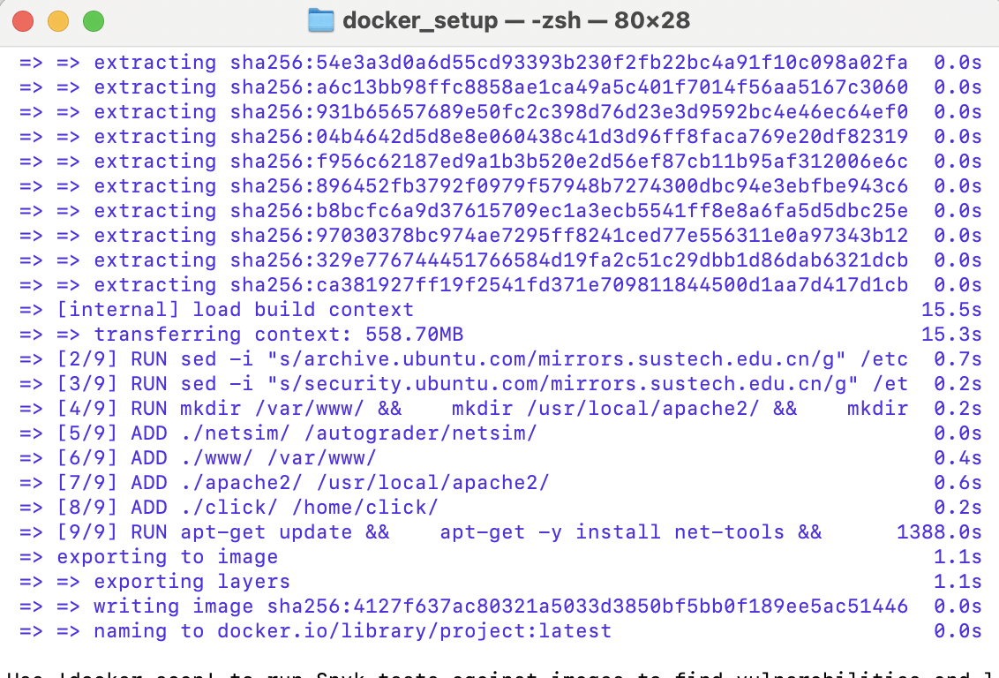
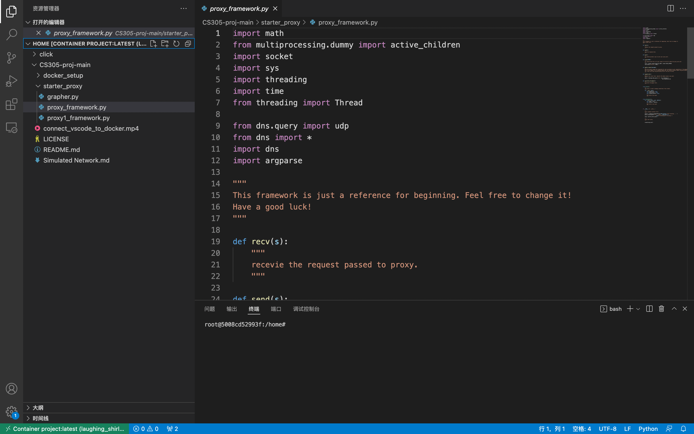

# CS305 Project Report

>2022.5.31

### Group Member

| SID      | NAME   | Work Division |
| -------- | ------ | ------------- |
| 11910104 | 王奕童 | 33.33%        |
| 11912714 | 任艺伟 | 33.33%        |
| 11912733 | 黄颖盈 | 33.33%        |

### Diagram and Analysis

#### onelink  alpha = 0.1

**Fairness:**                                               **Smoothness:**                                     **Utilization:**


**The first graph is the Fairness Index.**


***FI** is the fairness index, **T<sub>i</sub>*** is the transmission capacity of the *i* link in the network; ***O<sub>i</sub>*** is the actual throughput of the *i* link when all *n* links are working.The value range of ***FI*** is [1/n, 1].

Fairness fluctuates. We can see that the fairness changes from 1.0 to 0.6, and then 0.6 recovers to 1.0 after a period of time, which means that the network has been trying to maintain fairness. When ***FI*** is 1.0, it is absolutely fair that the actual throughput of each link is proportional to its transmission capacity, and each link uses wireless resources in proportion to its transmission capacity.

**The second graph is the Smoothness.**

The y axis is the derivative of bit rate with respect to time.

In the smoothness graph, we can also see that the graph presents a state of fluctuation, which is normal with fairness

**The third graph is the Utilization.**

When we first saw it, we thought the utilization graph was weird. After analysis, we think this is reasonable. Any utilization greater than 100% is the result of suddenly lowering the link bit rate. Since our utilization depends on duration and bit rate, when our duration is not small, the `duration * bit rate`does not fall so fast that the point is greater than 100%.

#### onelink  alpha = 0.5

**Fairness:**                                               **Smoothness:**                                     **Utilization:**


#### onelink  alpha = 0.9

**Fairness:**                                               **Smoothness:**                                     **Utilization:**


We can see the comparison of the three types of onelink graphs when alpha = 0.1, 0.5 and 0.9. When alpha is equal to 0.5, fairness, smoothness and utilization are very appropriate. In general, we believe that the network condition can be better predicted at this value. When alpha is equal to 0.1, the network speed is slow and cannot respond to sudden changes in bit rate. Therefore, the network is in bad condition when the bit rate changes suddenly. However, when the alpha value is 0.9, the network is too sensitive to the change of bit rate, resulting in large fluctuation and reduced stability.

#### twolink  alpha = 0.1

**Fairness:**                                               **Smoothness:**                                     **Utilization:**


#### twolink  alpha = 0.5

**Fairness:**                                               **Smoothness:**                                     **Utilization:**


#### twolink  alpha = 0.9

**Fairness:**                                               **Smoothness:**                                     **Utilization:**


The Utilization, Jain Fairness and Smoothness diagram of Twolink basically follows the rule of Onelink. Different from Onelink, under the influence of events, if the event changes of the two links are not synchronized, or the difference between the two event limits is large, the image will have obvious fluctuations. The frequency of the fluctuation increases with the increase of α, which can be observed more clearly in the figure.

#### sharelink  alpha = 0.1

**Fairness:**                                               **Smoothness:**                                     **Utilization:**


#### sharelink  alpha = 0.5

**Fairness:**                                               **Smoothness:**                                     **Utilization:**


#### sharelink  alpha = 0.9

**Fairness:**                                               **Smoothness:**                                     **Utilization:**


### Compile and Output

We follow the `README.md` in `CS305_proj`, and build images as follows. After that, we run the images.



We can find that it is bulit successfully, and there are the codes in it. We can modify and run it like `README.md`



### Log File

Our proxy can generate log file with right format.

#### log.txt

```python
<time> <duration> <tput> <avg-tput> <bitrate> <server-port> <chunkname>
```


#### netsim_log


### Basic Proxy

#### Params

`argv[0]` is the python file name.
`argv[1]` is `<--log>`, the path of log file that stores information.
`argv[2]` is` <--alpha>`, [0, 1], the coefficient in throughput estimate.
`argv[3]` is `<--listen-port>`, the TCP port that the proxy server listen on
`argv[4]` is `<--dns-port>`, the UDP port DNS server listens on.
`argv[5]` is `[<--default-port>]`, the port that specifys the port of the web server. If this param is nothing, our proxy will get a web server’s port through requesting DNS server.

#### Proxy & Forword Request

```python
class Proxy():
    def __init__(self, parser):
        # parse中得到的
        self.log_file = parser.log
        self.alpha = parser.alpha
        self.listen_port = parser.listen_port
        self.dns_port = parser.dns_port
        self.default_port = parser.default_port
        self.allBits = dict()
        self.low_rate = 0
        self.T_current = dict()
        self.exit_flag = Exit()

    def storeVideoRate(self):
        port = request_dns().decode()
        url = 'http://localhost:' + port + '/vod/big_buck_bunny.f4m'
        response = requests.get(url)
        content = response.content
        DOMTree = xml.dom.minidom.parseString(content)
        collection = DOMTree.documentElement
        apis = collection.getElementsByTagName("media") # 获取所有的api标签

        for api in apis: 
            # print(api.childNodes[0].data) # 获取api标签内的值
            if 'bitrate' in api.attributes.keys():
                self.allBits[int(api.attributes['bitrate'].value)] = api.attributes['url'].value
        sorted(self.allBits.keys())
        self.low_rate = int(self.allBits[list(self.allBits.keys())[0]])
```

#### Method to Exit Proxy

We set it up so that when the video is not playing and no request is made, we will start timing it, and if it goes beyond 10 seconds, our application will exit automatically. 10 seconds is for the convenience of demonstration in class inspection, but in real life, 10 seconds is not very reasonable, but here we just for demonstration, in fact, can also be changed to a more reasonable time.

```python
class Exit(threading.Thread):
    def __init__(self):
        threading.Thread.__init__(self)
        self.time = time.time()
        self.lock = threading.Lock()
        self.setDaemon(True)  # 设置为守护线程

    def refleshTiem(self):
        self.lock.acquire()
        self.time = time.time()
        # print('new time interval is ' , time.time() - self.time)
        self.lock.release()

    def run(self):
        while True:
            time.sleep(2)
            now = time.time()
            # print(now - self.time)            

            if now - self.time > 10:
                proxy.f.close()
                os._exit(0)
```

### Bit Rate Adaption

In real life, we often need to select the best rate for each video chunk. Therefore, we make an appropriate estimate of throughput in this part.

We get the `Content-Length` **B** of `headers`,  the start time **t<sub>s</sub>** and the end time **t<sub>f</sub>**. The throughput can be calculated by **B/(t<sub>f</sub>-t<sub>s</sub>)**. We should convert `byte/s` to the correct `kbps`, so it convert to **B*8/1024/(t<sub>f</sub>-t<sub>s</sub>)**.

Calculate throughput here.

```python
@app.route('/vod/<message>')
def video_request(message):
    port = request_dns().decode()
    message_m, rate = modify_request(message, port)
    url = 'http://localhost:' + port + '/vod/' + message_m
    ts = time.time()
    response = requests.get(url)
    tf = time.time()
    print(url)
    length = response.headers['Content-Length']
    calculate_throughput(port, ts, tf, length)
    return Response(response)
  
def modify_request(message, port):
    """
    Here you should change the requested bit rate according to your computation of throughput.
    And if the request is for big_buck_bunny.f4m, you should instead request big_buck_bunny_nolist.f4m 
    for client and leave big_buck_bunny.f4m for the use in proxy.
    """
    if message == 'big_buck_bunny.f4m':
        return 'big_buck_bunny_nolist.f4m'
    else:
        position = message.index("Seg")
        ·····
        return chunk, max_rate
          
def calculate_throughput(port, ts, tf, length):
    T_new = float(length)*8/1024/(tf-ts)
    print(proxy.T_current[port], proxy.alpha, T_new , tf-ts)
    lock.acquire()
    proxy.T_current[port] = proxy.T_current[port] * (1 - proxy.alpha) + proxy.alpha * T_new
    lock.release()
```

### DNS

#### Params

```python
argv[1] is fileName
argv[2] is port, the port of dnsServerPort
```

#### Determine if the port is occupied

Since we are not sure at runtime that the port in the file will definitely be open, we also wrote a method to check for it.

```python
def isPortFree(port: int, host: str = '127.0.0.1'):
    s = socket.socket(socket.AF_INET, socket.SOCK_STREAM)
    try:
        s.settimeout(1)
        s.connect((host, port))
        s.shutdown(socket.SHUT_RDWR)
        return False
    except Exception as e:
        pass
    return True
```

### Round-Robin

In our implementation, Round-Robin is like iteration, returning the next element of the port group each time. When the pointer to the previous port reaches the end of the port group, it starts at the front of the port group again.

```python
@app.route('/dnsRequest')
def dnsRequest():
    global previousPortIndex
    with open(fileName, encoding='utf-8') as f:
        allAvailablePort = [s.strip() for s in f.readlines()]
        if previousPortIndex is None:
            previousPortIndex = -1
        for i in range(1, len(allAvailablePort), 1):
            newPort = (previousPortIndex + i) % len(allAvailablePort)
            if isPortFree(int(allAvailablePort[newPort])):
                # 对于可以直接访问到的端口号，直接返回该端口号的response
                previousPortIndex = newPort
                re = flask.make_response(str(allAvailablePort[previousPortIndex]))
                return re

        # 如果找了一圈都没找到，那就执行RR(Round Robin)
        previousPortIndex = (previousPortIndex + 1) % len(allAvailablePort)
        return flask.make_response((allAvailablePort[previousPortIndex]))
```

### Bonus


